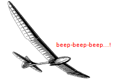
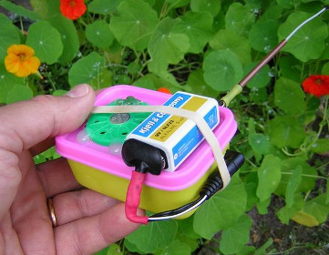
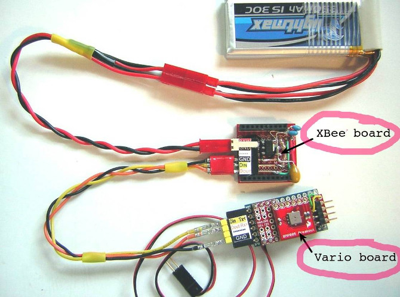

#Variometer TX RX  
 
This is pair of Arduiono sketches for generating, sending and receiving a variometer signal from a model glider to ground, using wireless UART serial communication via XBee technology. 

In the Tx-side sketch, it is worth noting that the sensor's pressure data stream is interrogated in the loop to determine altitude above ground (in 5 m increments), besides vertical speed calculations.

Uses an elaborate and fully temperature compensated routine outlined in the Bosch API, to accurately keep track of the actual altitude. The altimeter function translates barometric values to "true" altitude AGL, as pressure decreases non-linearly with height.

    

In the Rx-side sketch a start-up "jingle" indicates the major version number by the number of beeps ("3" in this case). Furthermore, the altitude data is monitored several times a minute for significant changes to the flight level, and if no signal is received for approximately five seconds a short warning beep is sounded. SpeakJet functions enable the synthetic voice speaker to announce the the model's altitude (presently up to 500 m AGL).

The variometer specific algorithm, which is accessed via a custom library named *EWMAcumStiction.h*, involves a couple of smoothing steps to filter out most of the signal noise, combined with an anti-hysteresis routine intended to provide a reasonable responsiveness and minimise output "stiction".

The acoustic variometer signals reflects climb speed, both in pitch and frequency (as variometers usually do). Earlier only the pitch of the tone varied.
The non-blocking Tone library (by Brett Hagman) is now used instead of the blocking standard tone() function.

Arduino IDE version 0023 was used when developing these sketches. They may or may not work "as is" with version 1.0 and later, but this has not been tested.

Link to project description: https://sites.google.com/site/xnebmisc/home/vario-project-3

 

